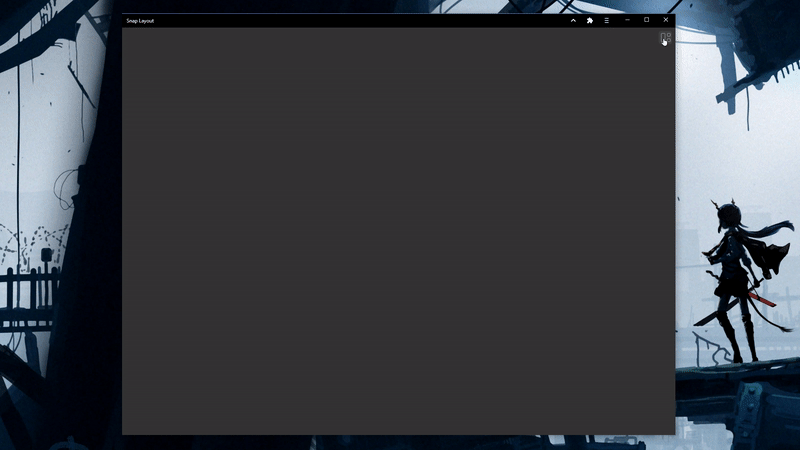

<h1 align="center">
	Snap Layout
</h1>
<p align="center">
  <br>
</p>

Snap Layout module for PWA's.

Note: It's not possible to resize a window or tab that wasn't created by `window.open()` or isn't a PWA. It's also not possible to resize when the window has multiple tabs.

This module uses `rem` for sizing, so to change the size of the module simply change the font size of the parent component.

This module uses $$restProps, which means you can pass any property to the root div, like style, class etc.
## Functions:
```jsx
import SnapLayout from 'snap-layout'

<SnapLayout hide={true} fill="grey" size="2rem">
```
- `hide` - boolean, hides the menu
- `fill` - CSS Color to use for the icon color
- `size` - CSS Size to use for the icon size

Or use as a web component outside Svelte:
```html
<script src="https://cdn.jsdelivr.net/npm/layout-snap@latest/dist/snap-layout.js"></script>
<body>
  <snap-layout fill="white" size="3rem"></snap-layout>
</body>
```